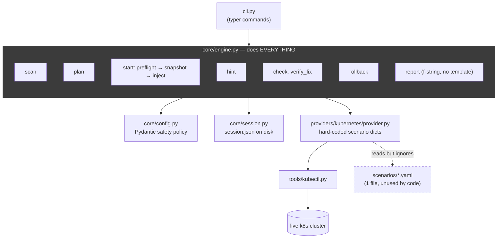
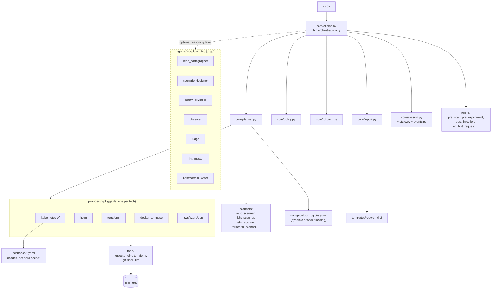
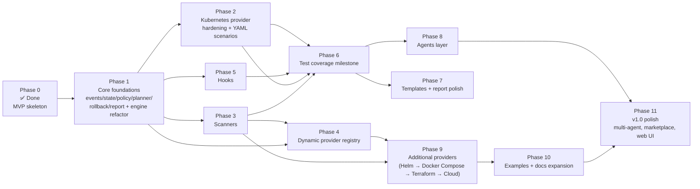
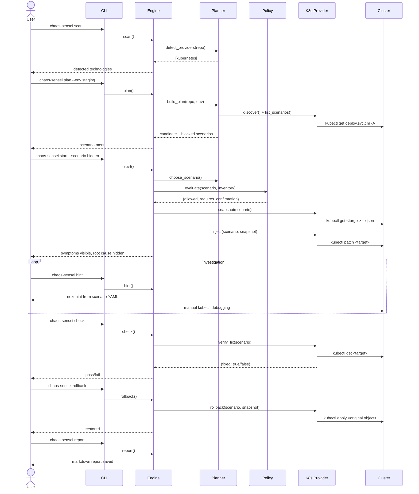

# Chaos Sensei — Build Roadmap

**Status as of:** 2026-07-13
**Purpose:** single source of truth for finishing Chaos Sensei — usable as a human reference *and* as a task spec an AI coding agent (Claude Code, Codex) can execute against directly.

## How to use this document

**If you are a human:** read top to bottom once, then use §4 (Phase Plan) as your working checklist. Each phase lists what to build, what it depends on, and how to know it's done.

**If you are an AI agent (Claude/Codex) executing this doc:** work through §4 phases **in order**. Do not skip a phase or jump ahead to a later one — every phase's "Depends on" line names the phases that must be *done* (not just started) first. Within a phase, tasks with no dependency on each other may be done in parallel; that's called out explicitly. After finishing each phase, run its "Definition of done" checks before moving on. If a phase's design conflicts with code you find in the repo, the repo's current state wins — update this doc rather than forcing code to match a stale plan.

**Ground truth for "what does the finished product do":** `chaos_sensei/` package in this repo + the original design doc at `project-template-devops/docs/ai/chaos_sensei_design.md`. This roadmap is the bridge between "design intent" and "current code."

---

## 1. One-sentence description

```
scan repo → detect stack → choose safe scenario → inject failure
→ observe symptoms → guide user → verify fix → rollback → write report
```

Chaos Sensei is a CLI "flight simulator" for on-call engineers: it reads an infra repo, quietly breaks something reversible in a non-prod environment, lets a human debug it like a real incident, and grades/reports the outcome.

---

## 2. Where we're starting from (Phase 0 — already built)

This is the actual state of the repo today, not the aspirational design. Total: ~1,700 lines of Python, one working end-to-end scenario.

| Piece | File | State |
|---|---|---|
| CLI | `chaos_sensei/cli.py` | ✅ all commands wired: `init scan plan start hint check rollback give-up report` |
| Config | `chaos_sensei/core/config.py` | ✅ Pydantic models, safety policy, provider toggles |
| Session | `chaos_sensei/core/session.py` | 🟡 minimal — has id/scenario/snapshot/hint_count, no status enum or event timeline |
| Engine | `chaos_sensei/core/engine.py` | 🟡 works, but is a 416-line monolith doing planning + policy + rollback + report generation all in one class |
| Provider contract | `chaos_sensei/providers/base.py` | ✅ abstract interface: `detect discover list_scenarios preflight snapshot inject observe verify_fix rollback` |
| Kubernetes provider | `chaos_sensei/providers/kubernetes/provider.py` | 🟡 `detect`/`discover`/`preflight`/`snapshot`/`rollback` work; scenarios are **hard-coded Python dicts**, not loaded from YAML; only 1 of 3 fault injectors implemented (`pod_crash` and `configmap_missing_key` raise `NotImplementedError`) |
| Scenario content | `providers/kubernetes/scenarios/service_selector_mismatch.yaml` | ✅ one complete, well-formed scenario — but the provider doesn't actually read this file |
| kubectl wrapper | `chaos_sensei/tools/kubectl.py` | ✅ safe subprocess wrapper, core verbs covered |
| Tests | `tests/test_config.py` | 🟡 config only, nothing else |
| Docs | `docs/architecture.md`, `safety-model.md`, `getting-started.md` | 🟡 exist, describe target state more than current state |

**Not started at all:** `scanners/`, `agents/`, `hooks/`, `templates/`, `data/`, `examples/`, `core/planner.py`, `core/policy.py`, `core/rollback.py`, `core/report.py`, `core/state.py`, `core/events.py`, every provider except Kubernetes.

### Current architecture (as built)



The monolith and the hard-coded scenarios are the two structural problems every later phase has to route around.

---

## 3. Where we're going (final product architecture)



Key structural shift from §2: the engine stops doing work itself and starts **delegating** — planning to `planner.py`, safety to `policy.py`, cleanup to `rollback.py`, writing to `report.py`. Everything else (scanners, more providers, agents, hooks) plugs into that stable core without needing to touch `engine.py` again.

---

## 4. Phase plan — dependency-ordered build sequence

### Dependency graph (which phase unblocks which)



**Reading this graph:** Phases 2, 3, and 5 all only need Phase 1 finished — they can run in parallel with each other (by different people, or different agent sessions) as long as Phase 1's core contracts (session state machine, policy engine, provider base) are stable and merged first. Phase 6 is a gate: don't start Phase 7/8 until it's green.

---

### Phase 1 — Core foundations *(no external dependency — do this first)*

**Depends on:** Phase 0 (already satisfied)
**Goal:** stop `engine.py` from being a monolith; give the app a real state machine.

| Task | New file | Notes |
|---|---|---|
| 1.1 | `core/events.py` | `EventType` enum — event names only, no logic |
| 1.2 | `core/state.py` | `SessionStatus` enum + `ALLOWED_TRANSITIONS` map |
| 1.3 | extend `core/session.py` | add `status`, `events: list[SessionEvent]`, `observations`, `add_event()`, `mark_*()` methods — depends on 1.1 + 1.2 |
| 1.4 | `core/policy.py` | `PolicyEngine.evaluate(scenario, inventory) -> {allowed, severity, requires_confirmation, reasons, blocked_by}` — reads `Config.safety` (already exists) |
| 1.5 | `core/rollback.py` | `RollbackManager.rollback()` / `.verify_rollback()` — calls `provider.rollback()`, updates session (needs 1.3) |
| 1.6 | `core/report.py` | `ReportBuilder.build_markdown()/.build_json()/.save()` — pulls report string out of `engine.py`, needs 1.3 |
| 1.7 | `core/planner.py` | `ScenarioPlanner.detect_providers()/.build_plan()/.choose_scenario()` — needs 1.4 |
| 1.8 | refactor `engine.py` | replace inline logic with calls to 1.1–1.7; keep public method names (`scan/plan/start/hint/check/rollback/give_up/report`) so `cli.py` doesn't change |

**Definition of done:**
- `engine.py` under ~150 lines, contains no policy/report/rollback logic inline
- `Session` round-trips through a real state machine; an illegal transition (e.g. `report()` before `injected`) raises, not silently succeeds
- existing CLI commands behave identically to today from a user's point of view (regression check against the one working scenario)

---

### Phase 2 — Kubernetes provider hardening

**Depends on:** Phase 1 (needs `policy.py` contract + stable `Session`)
**Goal:** make the *reference* provider actually match its own scenario YAML schema, and finish the two stubbed injectors.

| Task | Notes |
|---|---|
| 2.1 | `providers/base.py`: add `load_scenarios()`, `supports(scenario_id)`, `health_check()`, `verify_rollback()` as optional/default-implemented methods |
| 2.2 | `KubernetesProvider`: replace hard-coded scenario dicts in `list_scenarios()` with a YAML loader (`_load_scenario_files()`) reading `providers/kubernetes/scenarios/*.yaml` |
| 2.3 | implement `_inject_pod_crash()` (currently `NotImplementedError`) |
| 2.4 | implement `_inject_configmap_missing_key()` (currently `NotImplementedError`) |
| 2.5 | add scenario files: `pod_crash.yaml`, `configmap_missing_key.yaml`, `readiness_probe_failure.yaml` — same schema as `service_selector_mismatch.yaml` |
| 2.6 | `verify_fix()`: replace the single hard-coded selector/rollout check with logic driven by each scenario's `success_criteria` block |
| 2.7 | `tools/kubectl.py`: add `get_deployments()`, `get_endpoints()`, `describe()`, `logs()`, `delete_pod()`, `wait()` (parallel-safe, no dependency on 2.1–2.6) |

**Definition of done:** all 3 scenarios listed in `list_scenarios()` can be started, hinted, broken, fixed, verified, and rolled back end-to-end against a real cluster — not just the one that works today.

---

### Phase 3 — Scanners

**Depends on:** Phase 1 (planner needs somewhere to plug scanners into)
**Goal:** replace the crude "grep every yaml file for a substring" detection with real evidence-based scanning, reusable by the planner and later providers.

| Task | Notes |
|---|---|
| 3.1 | `scanners/repo_scanner.py` — orchestrator, walks repo, calls each specialized scanner, merges results |
| 3.2 | `scanners/k8s_scanner.py` — detects `kind:`/`apiVersion:` patterns, collects namespaces/service names/manifest paths |
| 3.3 | `scanners/helm_scanner.py`, `scanners/docker_scanner.py`, `scanners/terraform_scanner.py`, `scanners/terragrunt_scanner.py`, `scanners/ci_scanner.py` — same pattern, can be built in parallel with each other |
| 3.4 | wire `planner.py` (from Phase 1) to call `repo_scanner.scan()` instead of `provider.detect()`'s naive text search |

**Definition of done:** `chaos-sensei scan .` output includes evidence file paths per technology, not just a boolean; running it against `project-template-devops` correctly identifies Kubernetes, Helm, and Terraform all present.

---

### Phase 4 — Dynamic provider registry

**Depends on:** Phase 1 (engine refactor) + Phase 3 (scanners feed this)
**Goal:** stop hard-coding `KubernetesProvider` inside `engine._init_providers()`.

| Task | Notes |
|---|---|
| 4.1 | `data/provider_registry.yaml` — maps provider name → module path → class → `enabled_by_default` |
| 4.2 | engine loads providers dynamically from the registry + `Config.providers.*.enabled` instead of one `if kubernetes.enabled:` block |

**Definition of done:** adding a new provider (Phase 9) requires zero edits to `engine.py` — only a new registry entry.

---

### Phase 5 — Hooks

**Depends on:** Phase 1 (needs stable extension points in the refactored engine)
**Goal:** optional extension points so future logic (audit logging, rate-limiting, adaptive hints) doesn't bloat the engine.

| Task | Notes |
|---|---|
| 5.1 | `hooks/pre_scan.py`, `pre_experiment.py`, `post_injection.py`, `on_user_attempt.py`, `on_hint_request.py`, `on_verify.py`, `on_give_up.py`, `on_rollback.py`, `post_report.py` — each is `def run(context: dict) -> dict` |
| 5.2 | engine calls the relevant hook at each lifecycle point (best done alongside 1.8, but functionally independent — can land after) |

**Definition of done:** a hook can be added/removed by editing one file, with zero changes anywhere else, and a no-op hook file is provably a no-op (test asserts `run(x) == x` behavior for the default).

---

### Phase 6 — Test coverage milestone *(gate)*

**Depends on:** Phase 1, 2, 3 all merged
**Goal:** stop shipping on faith. This phase is a checkpoint, not new product surface — don't start Phase 7/8 until it's green.

| Order | Target |
|---|---|
| 1 | `tests/unit/test_state.py` — illegal transitions rejected |
| 2 | `tests/unit/test_policy.py` — forbidden namespace/kind/keyword cases |
| 3 | `tests/unit/test_session.py` — save/load round-trip, event log integrity |
| 4 | `tests/unit/test_repo_scanner.py` — fixtures in `tests/fixtures/` (fake k8s/helm/terraform trees) |
| 5 | `tests/unit/test_k8s_provider.py` — all 3 scenarios inject/verify/rollback against a mocked `kubectl` |
| 6 | `tests/unit/test_report.py` | 
| 7 | `tests/integration/test_full_flow.py` — start → hint → check → rollback against fake kubectl JSON fixtures |
| 8 | CLI smoke test |

**Definition of done:** `pytest -v --cov=chaos_sensei` covers `core/` and `providers/kubernetes/` at a level where a regression in state transitions or rollback would fail a test, not just be caught by a human later.

---

### Phase 7 — Templates & report polish

**Depends on:** Phase 1 (`report.py` exists) — cosmetic/output layer, not blocking anything else
**Goal:** move the report out of an f-string into a real template, and give `init` a real starter config.

| Task | Notes |
|---|---|
| 7.1 | `templates/report.md.j2` — Jinja2, sections: session info, scenario, symptoms, hints used, checks, root cause, ideal path, rollback result, lessons learned, next drills |
| 7.2 | `templates/chaos-sensei.yaml` — used by `chaos-sensei init` instead of `Config().to_yaml()` dumping defaults |
| 7.3 | `templates/safety-policy.yaml`, `templates/scenario.yaml.j2` |
| 7.4 | `data/scenario_taxonomy.yaml` — categories, difficulty levels, blast-radius definitions (used by planner ranking, Phase 1) |

---

### Phase 8 — Agents layer

**Depends on:** Phase 1, 2, 3, 6 (needs a *stable, tested* core+provider to reason about — do not build this on shifting ground)
**Goal:** add the reasoning/explanation layer the design doc describes. Every agent is `class X(BaseAgent): def run(context: dict) -> dict`. LLM calls, if any, go through one wrapper (`tools/llm.py`) so the rest of the app never talks to a model API directly.

| Order | Agent | Depends on |
|---|---|---|
| 8.1 | `agents/repo_cartographer/` | Phase 3 scanner output |
| 8.2 | `agents/scenario_designer/` | Phase 2 scenario schema |
| 8.3 | `agents/safety_governor/` | Phase 1 `policy.py` output |
| 8.4 | `agents/observer/` | Phase 2 `provider.observe()` |
| 8.5 | `agents/judge/` | Phase 2 `provider.verify_fix()` |
| 8.6 | `agents/hint_master/` | scenario YAML hints (already exist) |
| 8.7 | `agents/postmortem_writer/` | Phase 7 report template |
| 8.8 | `tools/llm.py` | only needed once an agent goes LLM-backed rather than pure data transform |

Each folder also gets a `SKILL.md` (purpose/inputs/outputs/rules/example) — see `docs/writing-providers.md`-style format.

**Definition of done:** engine can optionally call an agent at each lifecycle point without the mechanical (non-agent) path breaking if agents are disabled — agents are additive, not required.

---

### Phase 9 — Additional providers

**Depends on:** Phase 2 (stable reference implementation to copy the pattern from) + Phase 3 (scanner support) + Phase 4 (registry so adding one is a config change)
**Build order:** Helm → Docker Compose → Terraform (read-only) → Terragrunt → cloud (AWS/Azure/GCP) — matches the roadmap's own version sequence (v0.2 → v0.5) and increasing blast-radius risk.

| Provider | Notes |
|---|---|
| 9.1 Helm | wraps `tools/helm.py` (list_releases, get_values, template, status — read-only first) |
| 9.2 Docker Compose | `tools/` needs a compose wrapper; scenarios: broken health-check, broken dependency link |
| 9.3 Terraform | **read-only** initially — `tools/terraform.py` (version, fmt_check, validate, plan_json); no `apply`/`destroy` until safety model is proven out |
| 9.4 Terragrunt | thin layer over Terraform provider |
| 9.5 Cloud (AWS/Azure/GCP) | highest blast radius — do last, needs its own explicit safety review pass through `policy.py` |

---

### Phase 10 — Examples & docs expansion

**Depends on:** Phase 9 (needs real providers to build examples against) for the multi-tech examples; `k8s-helm-demo` can start as soon as Phase 2+9.1 land
**Goal:** every provider needs a working fixture repo so a new user can `cd examples/X && chaos-sensei scan .` and get a real result on day one.

| Task |
|---|
| 10.1 `examples/k8s-helm-demo/` |
| 10.2 `examples/docker-compose-demo/` |
| 10.3 `examples/terraform-aws-demo/` |
| 10.4 `examples/mixed-stack-demo/` (all of the above combined — proves repo-agnostic claim) |
| 10.5 expand `docs/architecture.md`, `docs/safety-model.md`, `docs/getting-started.md`; fill in the currently-placeholder `docs/writing-providers.md`, `docs/writing-scenarios.md`, `docs/report-format.md` |

---

### Phase 11 — v1.0 polish

**Depends on:** everything above
**Goal:** the roadmap items in the README that go beyond "does the core loop work" — multi-agent orchestration (agents actively collaborating, not just called in sequence), scenario marketplace, team training mode, CI/CD integration, web UI.

This phase is intentionally left loose — by the time Phases 1–10 are done, priorities here should be re-derived from actual user feedback, not pre-committed today.

---

## 5. Session lifecycle (target state, once Phase 1 lands)



---

## 6. Normalized contracts (keep every phase consistent)

Every provider method should return one of these shapes — this is what makes Phase 9 (new providers) cheap instead of a rewrite each time:

```python
# preflight()
{"allowed": True, "reason": "...", "warnings": [], "requires_confirmation": True}

# snapshot() is provider-specific but always dict-shaped and JSON-serializable

# inject()
{"injected": True, "fault_type": "...", "target": {...}, "details": "..."}

# verify_fix()
{"fixed": False, "details": "...", "observed_state": {...}}

# rollback()
{"rolled_back": True, "details": "...", "verified": True}
```

---

## 7. Reference material

- Design intent: `project-template-devops/docs/ai/chaos_sensei_design.md`
- Current package: `chaos_sensei/` in this repo
- Test target repo for the Kubernetes provider: `project-template-devops/platform/helm/charts/*-microservices` (5 microservice Helm charts with deployment/service/configmap manifests — good fixtures once Phase 9.1 Helm provider lands; usable today for the raw K8s provider if deployed via the repo's `kind` config)

---

## 8. Working checklist

- [ ] Phase 1 — core foundations (events, state, policy, planner, rollback, report, engine refactor)
- [ ] Phase 2 — Kubernetes provider hardening (YAML-driven scenarios, 3/3 injectors)
- [ ] Phase 3 — scanners
- [ ] Phase 4 — dynamic provider registry
- [ ] Phase 5 — hooks
- [ ] Phase 6 — test coverage gate
- [ ] Phase 7 — templates + report polish
- [ ] Phase 8 — agents layer
- [ ] Phase 9 — additional providers (Helm → Docker Compose → Terraform → Terragrunt → Cloud)
- [ ] Phase 10 — examples + docs expansion
- [ ] Phase 11 — v1.0 polish
